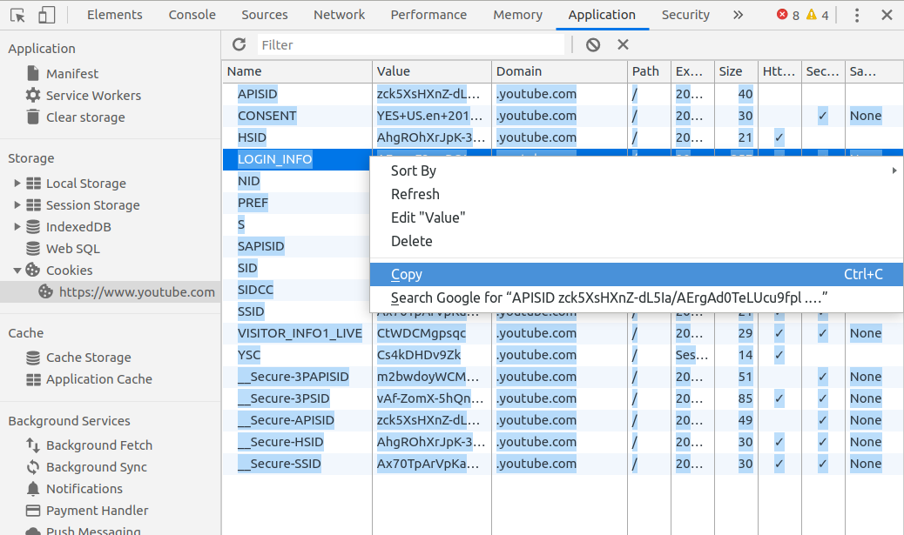

## Requirements

* A terminal/command line window
* [Node.js](https://nodejs.org/en/download/)

## Usage

1. Download [the script](https://raw.githubusercontent.com/dandv/convert-chrome-cookies-to-netscape-format/master/convert-cookies.js) (or clone this repo if you prefer)
2. In an editor, open a new blank file
2. In Chrome/Chromium, launch Developer Tools (F12)
3. Navigate to the site you need cookies from, e.g. YouTube, and log in.
4. Go to Application -> Storage -> Cookies
5. For each URL under Cookies (e.g. `https://www.youtube.com`), copy the table of cookies into the clipboard, then paste it at the end of the file you've opened in step 2. 
6. Save the file with a name like [file-with-cookies-copy-pasted-from-Chrome.txt]()
7. Run the script:

       node convert-cookies.js file-with-cookies-copy-pasted-from-Chrome.txt > netscape-cookies.txt

Now, `netscape-cookies.txt` will contain cookies ready to be used by any application that reads cookies in Netscape format (e.g. `yotube-dl` or `curl`).

